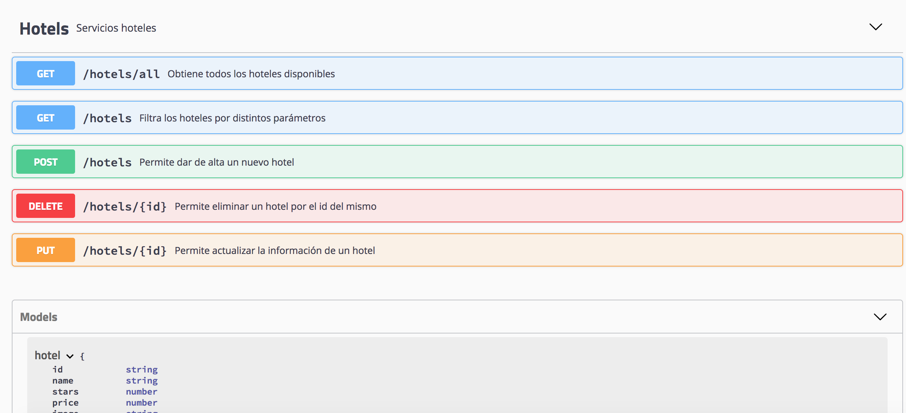

# Challenge Almundo Frontend Developer

# Frontend

App en React

  # Devtools

  

    
  

  # Storybook

  

    
  

  

    
  

# Backend

  # Swagger
  
  

    
  

  
Backend en Node.js

Se encuentran los readme de cada proyecto.

Autor : https://www.linkedin.com/in/mtorre4580/
